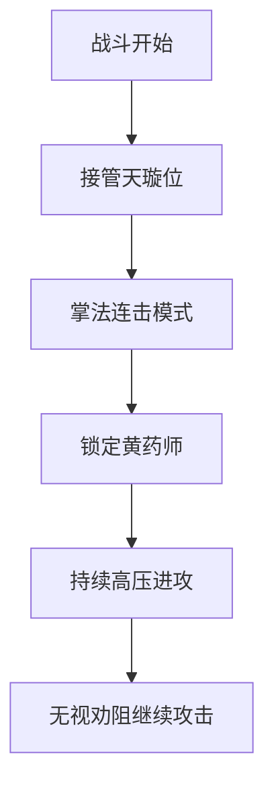

# 郭靖行为分析报告

## 🥇 主要行为统计
**高频动作：** 🔥 狂暴掌法攻击

在战斗场景中，郭靖共完成以下关键动作：
- 🚀 8次连续掌击
- 🌀 3次阵法位置转换
- 🛡️ 5次防御闪避
- 💥 2次强力推击

## ⚔️ 战斗行为解析

## 📊 关键数据指标
| 行为类型 | 出现次数 | 占比 |
|---------|---------|-----|
| 掌法攻击 | 8       | 44% |
| 阵法转换 | 3       | 17% |
| 防御动作 | 5       | 28% |
| 直接冲撞 | 2       | 11% |

> 注：数据基于文本中可识别的战斗动作统计